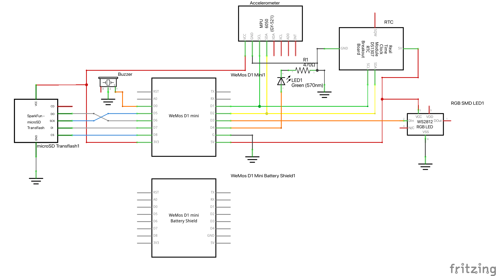

# Timer Dice - Firmware

# Getting Started
## Creating secret.h
Within your TimerCube directory, create a `secret.h` header file.  

Populate as follows:
```c++
// Network Config
#define WIFI_SSID "" // Your WiFi SSID (2.4GHz)
#define WIFI_PASS "" // Your WiFi Password

// MQTT
#define MQTT_URL  "" // MQTT Broker IP/URL
#define MQTT_USER "" // MQTT Username
#define MQTT_PASS "" // MQTT Password

// Device
#define APIKEY ""   // Timer Dice Server API Key (Not Currently Used
```

# B.O.M.
| **Component** 	| **Protocol** 	| **Description**                                                	|
|---------------	|:------------:	|----------------------------------------------------------------	|
| Wemos D1 Mini 	|       -      	| Microcontroller                                                	|
| MPU 6050      	|      I2C     	| Accelerometer                                                  	|
| DS1307 RTC    	|      I2C     	| Real Time Clock                                                	|
| TP 5400       	|       -      	| Wemos D1 Micro USB Charging Module (HAT)                       	|
|               	|      SPI     	| Micro SD Card Module                                           	|
|               	|       -      	| 3.7V LiPo Battery w/ JST Connector                             	|
| KY-012 Buzzer 	|       -      	| Buzzer Module                                                  	|
| WS2812B LED   	|       -      	| 5V Individually addressable LEDs. Approx. 6cm worth or 10 LEDs 	|
|               	|              	|                                                                	|

# Schematic
